# Лабораторная работа №4

# Задачи
- С помощью программного пакета Apache JMeter провести нагрузочное и стресс-тестирование веб-приложения в соответствии с вариантом задания.

- В ходе нагрузочного тестирования необходимо протестировать 3 конфигурации аппаратного обеспечения и выбрать среди них наиболее дешёвую, удовлетворяющую требованиям по максимальному времени отклика приложения при заданной нагрузке (в соответствии с вариантом).
- В ходе стресс-тестирования необходимо определить, при какой нагрузке выбранная на предыдущем шаге конфигурация перестаёт удовлетворять требованиями по максимальному времени отклика. Для этого необходимо построить график зависимости времени отклика приложения от нагрузки.

# Параметры тестируемоего приложения
- стоимость первой конфигурации 3900
- стоимость второй конфигурации 7500
- стоимость третьей конфигурации 8500
- максимальное количество параллельных пользователей 5
- средняя нагрузка, формируемая одним пользователем 40 запросов в минуту
- максимально допустимое время обработки запроса 900 мс

# Дерево тестово плана
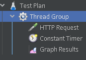

# Конфигурация Throughput таймера
165 семплов в минуту, так как это как раз и есть 40 запросов в минуту от 5 пользователей.

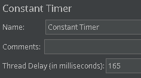

# Конфигурация Thread Group
Pamp-up perion равен нулю, чтобы все потоки активировались одновременно

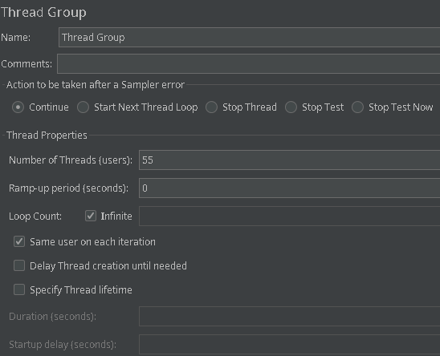

## Нагрузочное тестирование первой конфигурации (5 потоков)
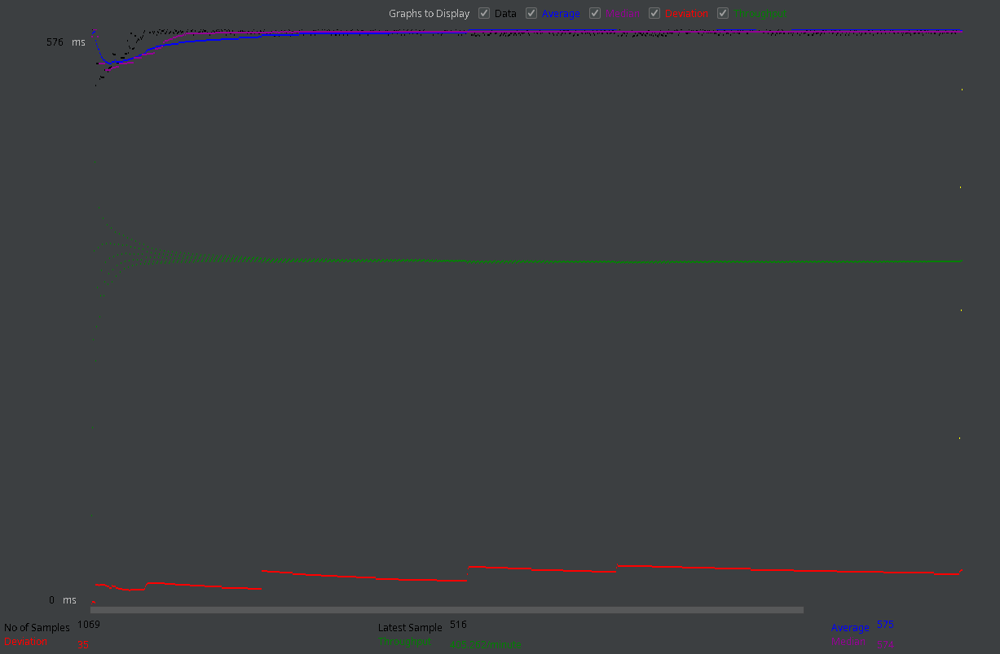
## Нагрузочное тестирование первой конфигурации (10 потоков)
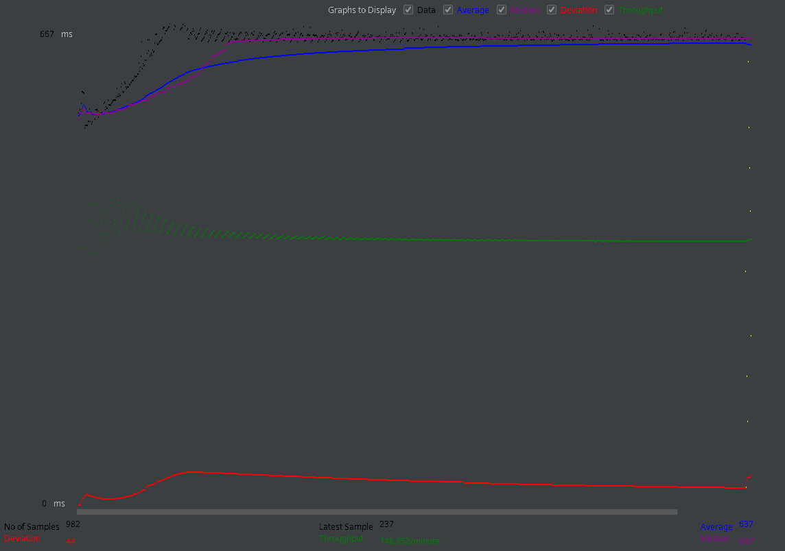

## Нагрузочное тестирование второй конфигурации (5 потоков)
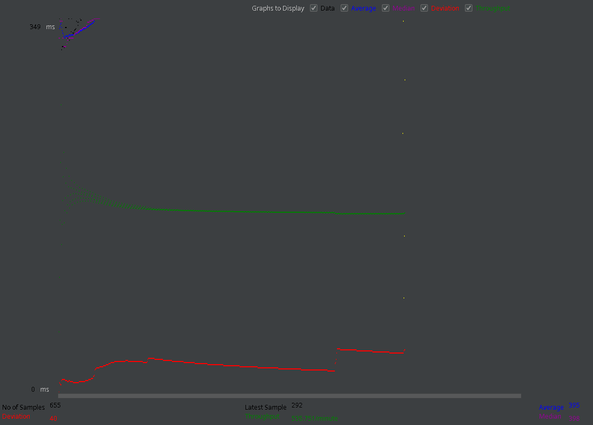
## Нагрузочное тестирование второй конфигурации (10 потоков)
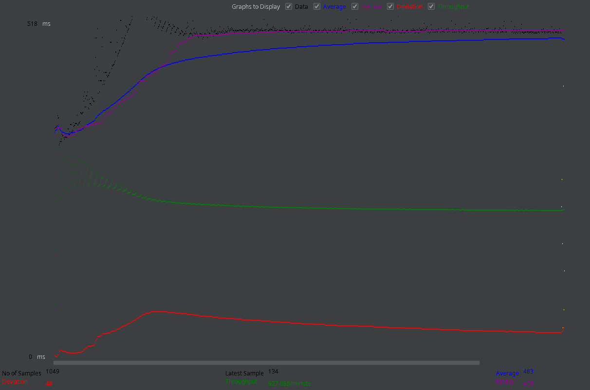

## Нагрузочное тестирование третьей конфигурации (5 потоков)
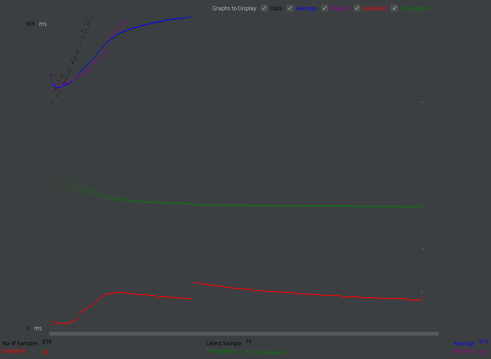
## Нагрузочное тестирование третьей конфигурации (10 потоков)
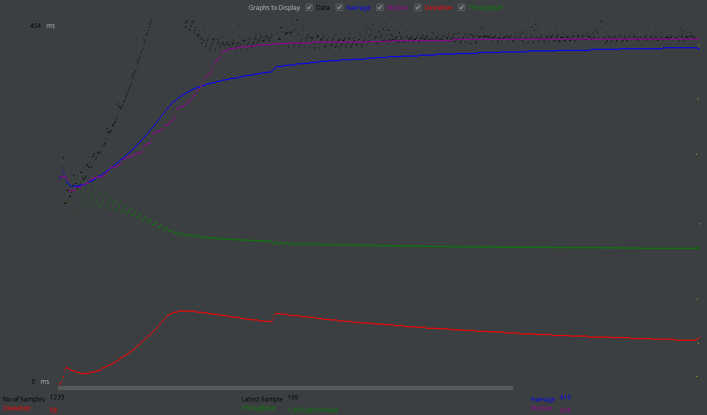

## Стресс тестирование первой конфигурации
### Первая конфигурация выдерживает 60 пользователей
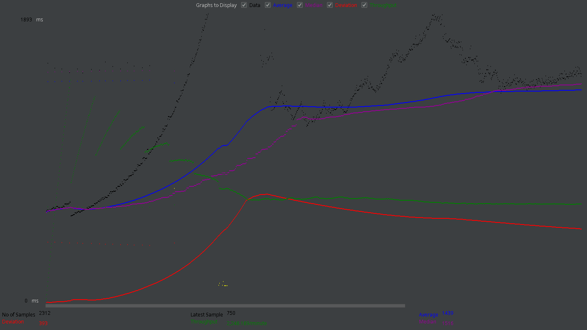
### Но падает при 65 пользователях
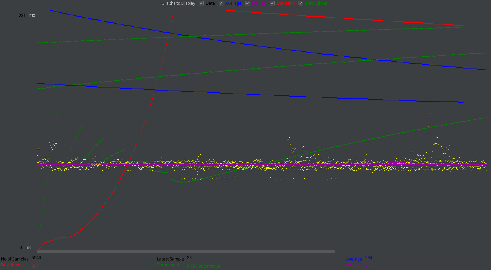
### Информация о нагрузке от приложения
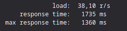

## Стресс тестирование второй конфигурации
### Вторая конфигурация выдерживает 55 пользователей
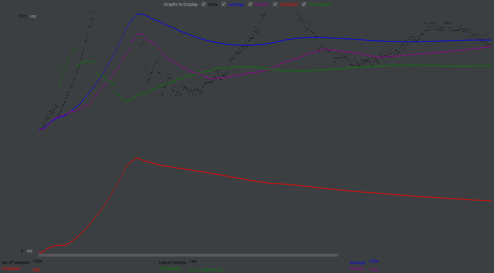
### Но падает при 60 пользователях
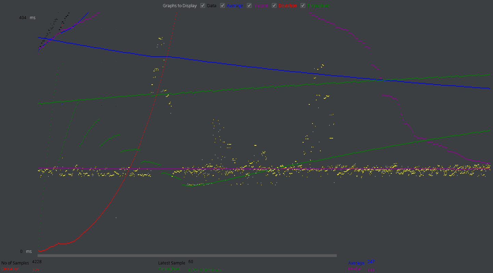
### Информация о нагрузке от приложения
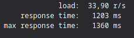

## Стресс тестирование третьей конфигурации
### Третья конфигурация выдерживает 50 пользователей
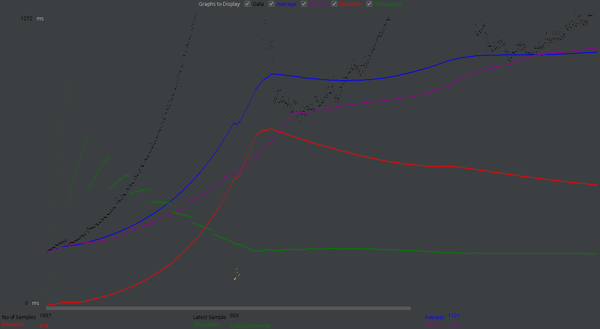
### Но падает при 55 пользователях
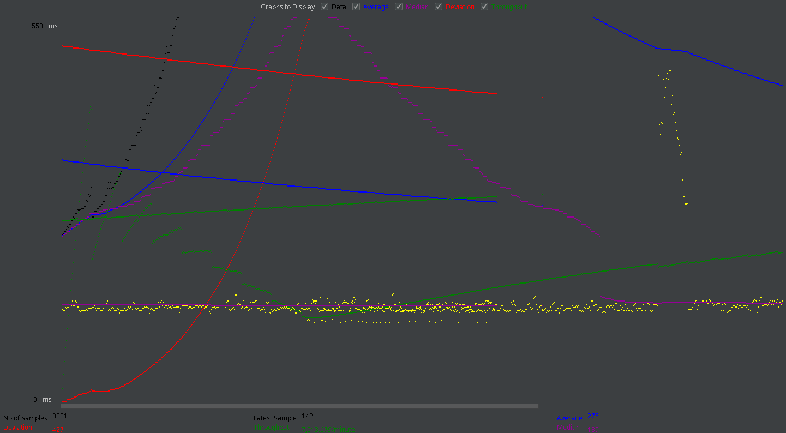
### Информация о нагрузке от приложения
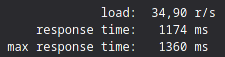

# Вывод
Первая конфигурация показала себя гораздо лучше, чем вторая и третья, и в нагрузочном тестировании и в стресс тестировании. Но время отклика выше, чем во второй и третьей. В случае если время отклика не важно стоит выбрать первую конфигурацию, так как она дешевле. Если важно время отклика то оптимальный выбор вторая конфигурация, она хоть и дороже но время отклика меньше. Третья конфигурация является самой не оптимальной ни по цене ни по времени отклика, ни по тестированиям.